1.远程登录 shell 服务器（连接方式查看入学须知贴）。 
输入ssh jck282141@shell.ceshiren.com 回车  
输入密码  
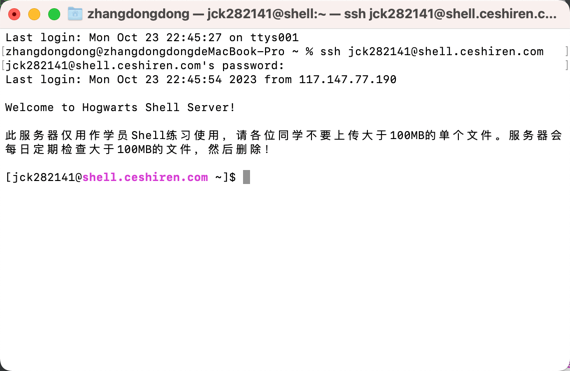

2.启动 python 服务： 
检查服务状态。 
浏览器访问服务。 
python -m http.server 8666 
ps -ef |grep python 
netstat -nlp |grep 8666 
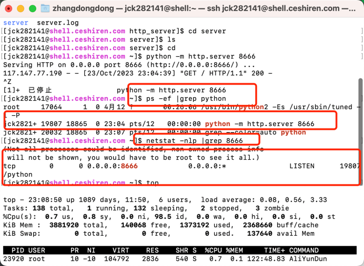
top
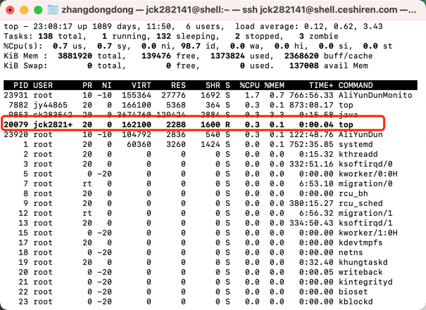
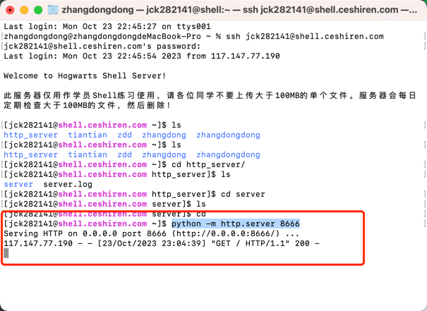
http://shell.ceshiren.com:8666/
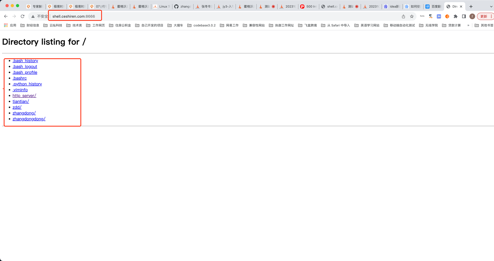

3.启动 ceshiren jar 包： 
检查服务状态。 
浏览器访问服务。 
java -jar zdd/ceshiren.jar --server.port=8777
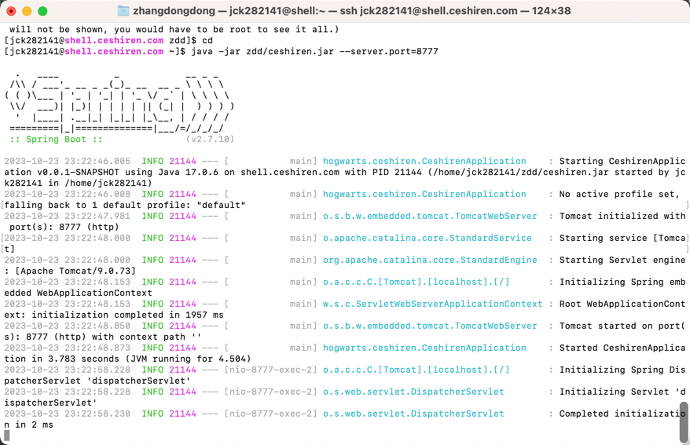
ps -ef |grep ceshiren 
netstat -nlp | grep :8777
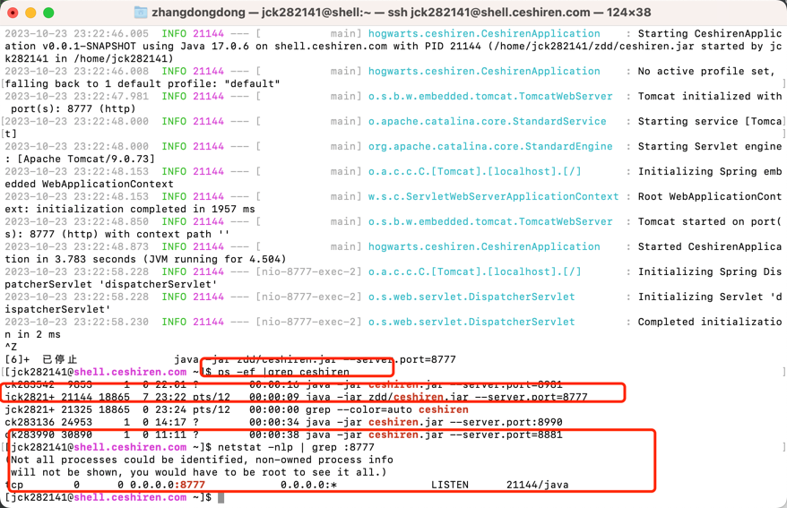
top
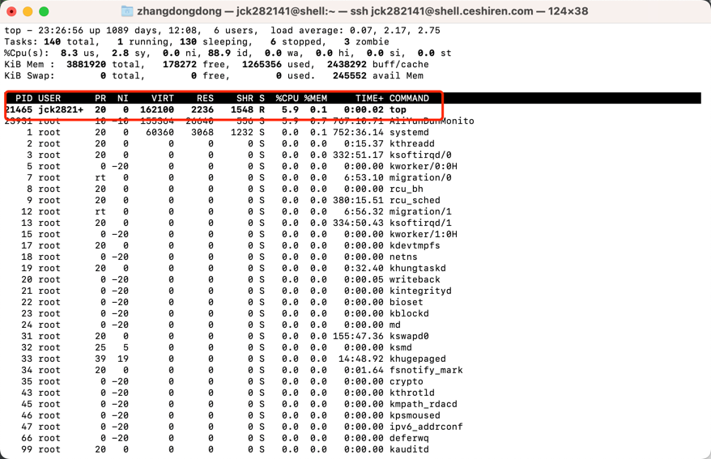
http://shell.ceshiren.com:8777/
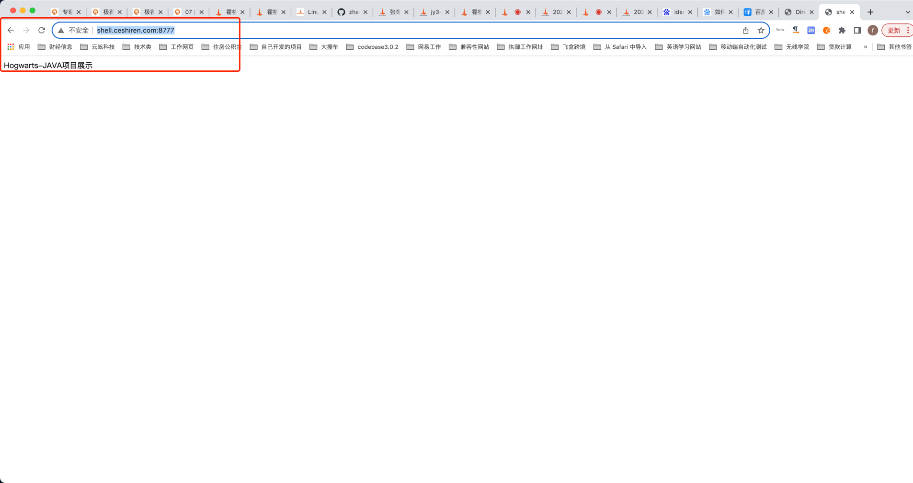

nohup java -jar zdd/ceshiren.jar --server.port=8555 > nohup.out 2>&1 & 
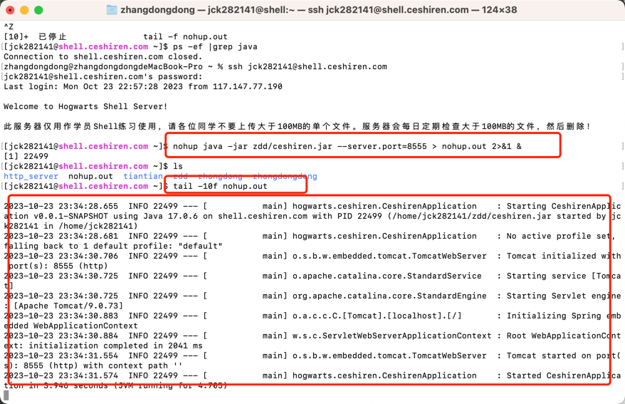
http://shell.ceshiren.com:8555/
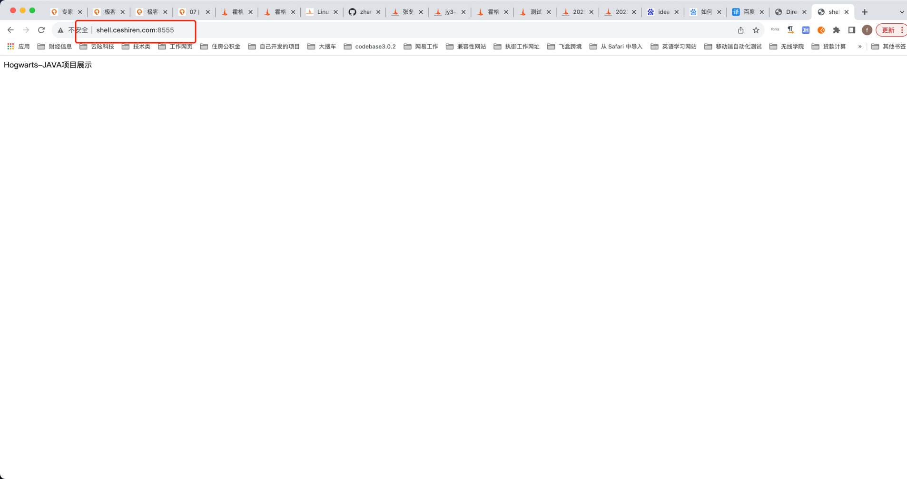

4.搭建 PetClinic 宠物医院。 
使用 SQL 语句新增数据宠物主人数据。 
在 Petclinic 页面中新增宠物主人信息。 
编写 SQL 语句查询新增数据的正确性。 

端口选择：8090-9000 之间的某一个，不要冲突。 
提交服务启动之后的浏览器访问截图即可。

