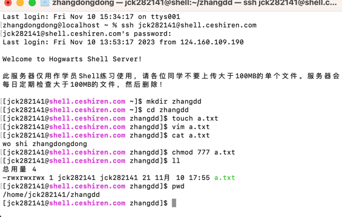

Linux系统登录与文件操作 
登录 Linux 系统： 
学员练习系统：账号密码参考入学须知贴。 
ssh jck282141@shell.ceshiren.com 
输入密码 

完成以下操作 
创建新目录。 
mkdir zhangdd
切换到新目录下。 
cd zhangdd  
创建新文件，在新文件中添加内容。 
touch a.txt  
vim a.txt  
按i进入编辑模式  
输入文件内容  
按esc 
输入:wq 然后回车 
查看新文件中的内容。 
cat a.txt
修改新文件权限为可读、可写、可执行。 
chmod 777 a.txt
查看当前目录。 
显示当前文件夹pwd 
线上当前文件下所有文件信息ll 
